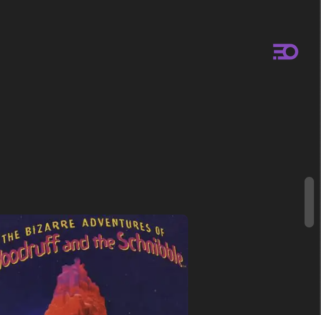

  
  <h2 align="center">
    @growthspace-engineering/qa-interview-e2e
  </h2>

  Automation Home Assignment for GrowthSpace

## Getting Started

We're going to test an Arcade Game Playlist application: https://arcade.kibibit.duckdns.org/

This application shows a list of games and comes with a few by default

The application can:
| Feature                            | Description                          | Screenshot                             |
|------------------------------------|--------------------------------------|----------------------------------------|
| Show all games in the collection   | Main screen displaying all games.    |                                        |
| Enter edit mode                    | Allows adding or deleting games.     |  |
| **[Edit Mode]** Add new game       | Adds a new game to the collection.   |  |
| **[Edit Mode]** Delete existing game | Deletes a game from the collection. |  |
| **[Edit Mode]** Exit edit mode     | Exits the edit mode.                 |  |
| **(BONUS)** [Attract Mode](https://en.wiktionary.org/wiki/attract_mode)     | Screen saver that shows all games in a roulette, switching games every few minutes |  |

it works with a backend application with the following swagger documentation: https://arcade.kibibit.duckdns.org/api/docs

Assignment Goals:
- Detailed STD for planned tests
- Testing application features:
  - Edit Mode
  - Add a game
  - Delete a game
  - Main View (View All Collection Games)
  - Game Details Modal
- Should have prep and teardown for each test preferably using API calls. Tests should create the data they need and clean up after themselves :-)
- minimal code duplication
- scalable architecture to support more tests on existing pages, modals, etc.

Bonus Goals:
- Integrate at least 1 feature for playwright. It can be visual testing, lighthouse, or any feature you'd like to integrate. Create at least 2 tests using the feature
- Write tests for the attract mode screensaver
  
