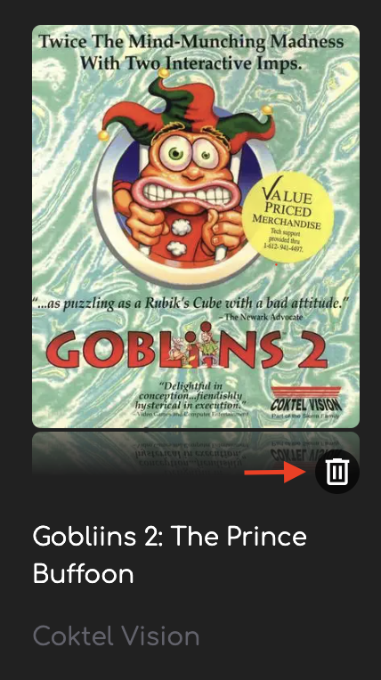
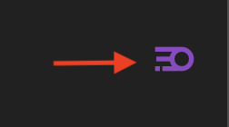

<p align="center">
  <a href="https://github.com/growthspace-engineering" target="blank">
  </a>
  <h2 align="center">
    @growthspace-engineering/automation-engineer-interview
  </h2>
</p>
<p align="center">
  Automation Home Assignment for GrowthSpace
</p>
<hr>

## Prerequisites

Before getting started, ensure you have the following installed:
- Node.js (Version 20.6.1 or later)

This project is compatible across different operating systems. Administrator rights might be required for certain npm installations.

## Getting Started

Test an Arcade Game Playlist application: http://ec2-13-49-145-115.eu-north-1.compute.amazonaws.com:3000/

This application displays a list of games and includes a few by default.

For testing purposes, the game collection will be reset to normal, everyday at 4:00 AM Israel Time.

This exercise focuses on E2E tests only. API tests are not part of this exercise scope.

## Application Main Sections

| Feature                            | Description                          | Screenshot                             |
|------------------------------------|--------------------------------------|----------------------------------------|
| Show all games in the collection   | Main screen displaying all games.    |                                        |
| Enter edit mode                    | Allows adding or deleting games.     |  |
| **[Edit Mode]** Add new game       | Adds a new game to the collection.   |  |
| **[Edit Mode]** Delete existing game | Deletes a game from the collection. |  |
| **[Edit Mode]** Exit edit mode     | Exits the edit mode.                 |  |
| **(BONUS)** [Attract Mode](https://en.wiktionary.org/wiki/attract_mode)     | Screen saver that shows games in a roulette, switching every few minutes. It should spin the game list and stop on a game for 1-2 minutes, showing that game's details, and then spin again |  |

## Some words from the 👩‍💼 Product Manager
When adding a new game to the Arcade Game Playlist application, it's essential to ensure the data entered meets our specific criteria for a seamless and error-free user experience. Below, we outline the expected validations and behaviors for each field in the "Add Game" form.

- **Title:** Every game needs a unique title that stands out. The title should be between 2 and 150 characters. This ensures clarity and prevents games from being indistinguishable from each other.
- **Description:** The game's description should provide players with insight into what to expect from the game, requiring a length between 10 and 5000 characters. This ensures that users receive enough information to understand the game's premise and gameplay experience.
- **Platform:** Selection of the platform is critical. The game must be associated with one of our supported platforms (e.g., Windows, Nintendo Wii). This information helps users filter and find games suitable for their systems (available options was documented in swagger models already).
- **Developer:** The name of the game's developer is required and must be provided, highlighting the entity responsible for creating the game. This field must be filled with a string that is concise yet descriptive, with a maximum of 150 characters. The developer's name gives users insights into the game's development background, potentially influencing their interest based on the reputation or previous works of the developer.
- **Publisher:** Similarly, the game's publisher must also be identified, ensuring that the game is attributed to the correct publishing entity. This field is mandatory and accepts a string with up to 150 characters. The publisher's name is crucial for users to understand the game's distribution and marketing background, often associated with the game's availability and support.
- **Release Date:** The release date should be provided in a valid date format and must be a date in the past, reflecting the game's availability to the public.
- **Play Mode:** This field is required and describes the game's play mode, such as "Single Player" or "Multiplayer." This information is crucial for users to understand the type of gameplay experience they can expect. The play mode should be a descriptive string, ranging from 5 to 25 characters, to provide clear and concise information about how the game is played.
- **Max Players:** This field is also required for games that support multiplayer modes, indicating the maximum number of players that can participate simultaneously. The value must be an integer between 1 and 15, inclusive. Specifying the max players is essential for users to know whether the game suits their social gaming needs and preferences.
- **Community Star Rating:** This field captures the average star rating given to the game by the community, on a scale from 1 to 5. The value must be a number that reflects the collective assessment of the game's quality and appeal, including decimal points for precision. This rating is a crucial indicator of the game's reception among users, guiding potential players in their decision to engage with the game based on community feedback.
- **Community Star Rating Total Votes:** Alongside the star rating, it's essential to note the total number of votes that contributed to this rating. This field is an integer representing how many community members have voted, starting from 1 for a new game since an initial vote is mandatory. The total votes count provides context to the star rating, indicating the breadth of community engagement and the reliability of the rating score. A higher number of votes typically signifies a more universally accepted rating.

## Backend API for Prep & Teardown

Works with a backend application. Swagger documentation: http://ec2-13-49-145-115.eu-north-1.compute.amazonaws.com:3000/api/docs

## Assignment Goals (🕒 3-4 hours):

- Implement critical test cases for application features:
    - Edit Mode
    - Adding a game
    - Deleting a game
    - Main View (View All Collection Games)
    - Game Details Modal
- Include prep and teardown for each test, preferably using API calls, to manage test data.
- Aim for minimal code duplication and a scalable architecture.
- Clean, readable code

## Bonus Goals (🕒 1-1.5 hours):

- Integrate at least one advanced Playwright feature (e.g., visual testing, lighthouse, testing multiple screen sizes). Create at least two tests using this feature.
- Write tests for the Attract Mode screensaver.

## Running the Project

### Setup
1. Install Project Dependencies
    ```bash
    npm install
    ```

2. Install playwright's browsers
    ```bash
    npm run playwright:install
    ```

3. Run tests with
    ```bash
    npm run test
    ```
    or run them interactively with

    ```bash
    npm run test:ui
    ```

## About Playwright
See the playwright documentation for more.
Some links to get you started:
- [Writing Tests](https://playwright.dev/docs/writing-tests)
- [Generating Tests](https://playwright.dev/docs/codegen-intro)
- [Running and Debugging Tests](https://playwright.dev/docs/running-tests)

## Prefer to use Cypress or something else?
You're welcome to use any testing framework you're comfortable with. Just let us know in your submission email.
Also take into account that you need to generate the project seed for yourself if not using Playwright.

Also, include an explanation on how to run your tests in the submission email.

## Submission Guidelines

<!-- You have two options for submitting your completed assignment: -->

<!-- 1. Fork this project and submit a link to a public repository containing your solution. Please include a verbal explanation of your work in the email submitting the home assignment. -->
Clone the project and send a zip file containing the completed assignment and a verbal explanation by email.

**:warning: Do not create a public fork\clone of this repository :warning:**

Include both Neil and Christina in the Email (See contact information below)

## Troubleshooting

If you encounter any technical issues or have questions regarding the assignment, please contact Neil Kalman. For contact details, see the information provided at the end of this document.

---

## Contact Information

- **Neil Kalman**
  - **Email:** neil.kalman@growthspace.com
  - **Phone:** 0523531234
  - **Role:** Tech-Lead; Contact for technical issues and assignment questions.
  
- **Christina Mattar**
  - **Email:** christina.mattar@growthspace.com
  - **Phone:** 0505737266
  - **Role:** Talent Acquisition Specialist; Contact for process-related questions and general questions.
